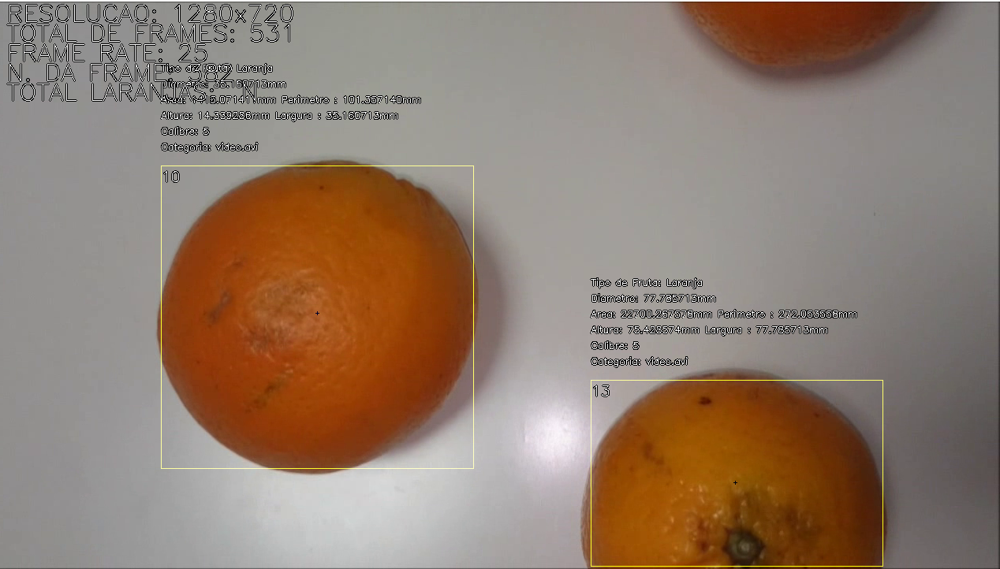
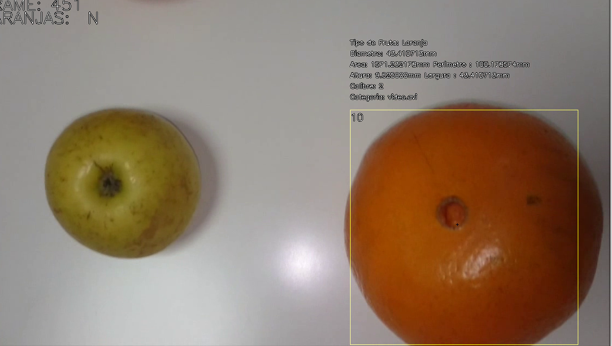

<i>"Tell me and I forget. Teach me and I remember. Involve me and I learn." — Benjamin Franklin</i>

---

## Project Overview
This project, developed as part of a **Computer Vision** course assignment, aimed to design an **Orange Recognition System** for automating tasks in a citrus fruit production line. The system focused on:

- Counting the total number of oranges
- Calculating the area and perimeter of each orange
- Identifying the location (bounding box) and center of gravity
- Measuring orange size based on caliber standards (Quality Standards for Citrus Fruits)
- Classifying oranges by quality (Commission Regulation EEC 379/71)

### Key Details
- **Language**: C++
- **Focus**: Implementing algorithms manually for image processing without using pre-built libraries
- **Purpose**: To enhance understanding of fundamental computer vision techniques and their industrial applications

---

## Features
- Accurate orange identification in complex scenes with other fruits
- Quality assessment and categorization based on international citrus fruit standards
- Automated measurements improving efficiency and reducing human error in production lines

---

## Technologies

  
  

### Tools & Libraries
- **C++**: Core programming language
- **OpenCV**: Image processing library (optional for exploration)
- **Git & GitHub**: Version control and project management

---

## Gallery

  

  

  

  

  

    
    
Orange identification and segregation

  

---

## Skills Developed
- **Algorithm Design**: Developed custom algorithms for object detection and feature extraction
- **Image Processing**: Applied techniques to calculate geometric properties and classify objects
- **C++ Expertise**: Gained deeper knowledge of manual coding for performance-critical applications
- **Version Control**: Used Git and GitHub to manage project changes and collaborate effectively

---

## Outcome
This project provided an effective solution for automating quality control in citrus fruit processing. By manually developing algorithms, it highlighted the importance of a deep understanding of computer vision fundamentals and their industrial applications.
