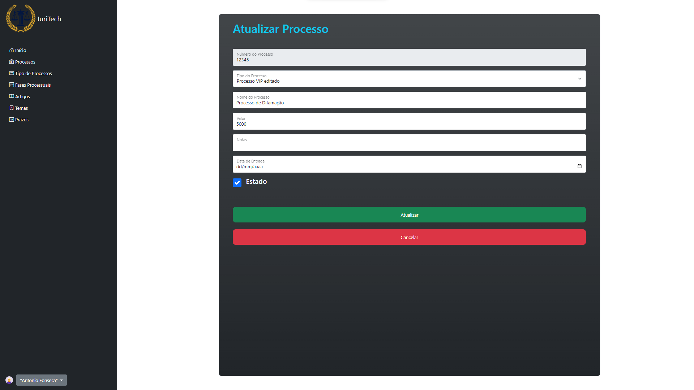

<i>> "Automation applied to an efficient operation will magnify the efficiency. Automation applied to an inefficient operation will magnify the inefficiency." — Bill Gates</i>

## Overview

The Support System for Lawyers is a web platform created as part of a collaborative project, aimed at streamlining legal case management. The platform automates critical legal tasks and helps lawyers comply with strict government deadlines. By integrating advanced features like case management, document tracking, and deadline monitoring, this system minimizes human error and optimizes the efficiency of legal operations.

## Project Versions

The project was developed in two versions:
- **Version 1:** Built with pure JavaScript, focusing on foundational functionality.
- **Version 2:** Rewritten using Angular for enhanced performance, scalability, and maintainability.

This platform integrates **PostgreSQL** as the database solution, providing secure and reliable storage for all case-related data.

## Collaboration and Tools

The team worked collaboratively, using [GitHub](https://github.com/JoelJonassi/JuriTechRESTFullAPIandWeb) for version control and project management through **Jira**, applying Agile methodologies to ensure iterative development and continuous improvement.

## Features & Screenshots

### Case Management and Documentation

- **View Articles**: Easily view and manage legal articles relevant to the cases at hand.  
  

- **Create Deadlines**: Add and manage deadlines directly within the system for each case.  
  

- **Create and Manage Cases**: The system allows users to create and update case details and track the progress.  
    
  

- **Upload Documents**: Upload case documents directly to the platform for easy access and sharing.  
  

### User Interface

The platform features an intuitive user interface with options for seamless login, navigation, and data access.  

## Technologies Used

The following technologies were used to build and deploy the Support System for Lawyers:

- **C#**: The primary programming language used for backend logic.
- **Angular**: Framework used for frontend development, ensuring a responsive and scalable UI.
- **PostgreSQL**: Used for secure and reliable data storage.
- **Bootstrap**: For responsive design and UI components.
- **Visual Studio**: The IDE used for development.
  
### Technology Icons

  
  
  
  
  

## Conclusion

The Support System for Lawyers is designed to improve efficiency in legal practice by automating routine tasks and providing an easy-to-use interface for managing legal cases. The use of **Angular**, **C#**, and **PostgreSQL** ensures a scalable, secure, and high-performance system, while Agile development principles and collaboration tools like **GitHub** and **Jira** helped the team work efficiently throughout the project.
