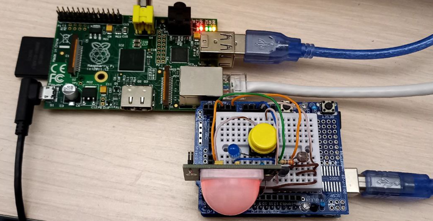
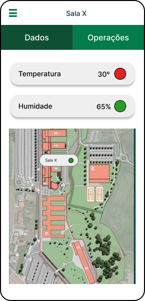
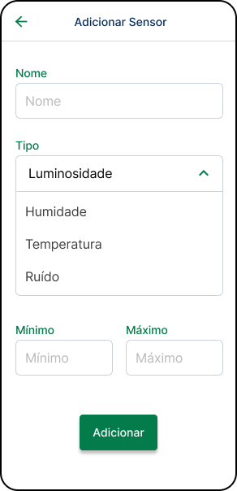

<i>"Tell me and I forget. Teach me and I remember. Involve me and I learn." — Benjamin Franklin</i>

## Smart Rooms Project Overview

The Smart Rooms project optimizes classroom environments by integrating IoT (Internet of Things) technology with mobile applications to improve energy efficiency and enhance the learning experience. This system provides real-time monitoring and control of environmental factors such as temperature, humidity, and air quality.

The project focuses on creating a connected classroom experience where environmental parameters are dynamically controlled and monitored. By leveraging IoT sensors and embedded systems, it allows students, staff, and facility managers to interact with the environment via a mobile application. The app supports easy navigation, offering insights into room conditions and enabling control over critical systems like lighting, HVAC, and ventilation. 
Feel free to explore the <a href="https://github.com/JoelJonassi/SmartRooms" target="_blank"> GitHub </a> repository for the project.

### Key Features:

  <ul>
    <li><strong>Real-Time Monitoring:</strong> Collects and displays environmental data, such as temperature, humidity, and air quality, to optimize the classroom environment.</li>
    <li><strong>Control Features:</strong> Allows users to control classroom parameters such as air conditioning, lighting, and sensors from a mobile app.</li>
    <li><strong>Energy Efficiency:</strong> Provides insights to help users make informed decisions, contributing to sustainable energy use in classrooms.</li>
    <li><strong>User-Friendly Interface:</strong> The mobile app ensures seamless interaction with the system, offering intuitive access to both students and staff.</li>
  </ul>

  Check out the full source code, documentation, and reports for the Smart Rooms project on 

### Technologies Used:
  
- **Mobile Development:** Kotlin for Android applications, integrating REST APIs for data communication.
- **IoT & Embedded Systems:** Raspberry Pi and Arduino used to interface with environmental sensors and actuators.
- **Server-side & Database:** ASP.NET for backend services, PostgreSQL for storing system data.
- **Programming Languages:** Python for sensor data processing and system integration.

  
  
Developed Embedded System for Smart Room Automation

  <video width="640" height="320" controls class="centered">
    <source src="../assets/images/SmartRooms/SmartRoomsVideo.mp4" type="video/mp4">
  </video>

Live Demonstration of the IoT System in Action

  

    

      
    

    

      
    

    

      
    

    

      
    

    

      
    

    

      
    

  

  

    
    
SmartRooms Application Flow

  

  <h2>Technologies Used</h2>
  

    
    
    
    
    
    
    
    
    
  

